## 1. Концепция IDEF

IDEF (Integrated DEFinition) — это семейство стандартизированных методологий, разработанных для комплексного моделирования различных аспектов сложных систем.

История: Возникло в конце 1970-х – начале 1980-х гг. в рамках программы ВВС США ICAM (Integrated Computer-Aided Manufacturing) для анализа и улучшения производственных процессов.

Основная цель: Предоставить набор строгих, взаимодополняющих и стандартизированных методов для описания системы с разных, но связанных точек зрения.

Ключевая идея: Нельзя полноценно описать сложную систему с помощью одной модели. Нужен набор взаимосвязанных моделей, каждая из которых фокусируется на определенном аспекте (функции, данные, процессы).

Статус: Сегодня IDEF — это де-факто международный стандарт в области структурного анализа и моделирования бизнес-процессов.

Семейство включает более 15 методов, но ключевыми и наиболее используемыми являются три, образующие базовый комплект для анализа:

|Метод|Полное название|Основной фокус моделирования|Что описывает|Ключевой вопрос|
|---|---|---|---|---|
|**IDEF0**|**Функциональное моделирование** (наследник SADT)|**Структура и функции** системы.|Взаимосвязи **функций (работ)**, их входы, выходы, управления и механизмы. **Статическая функциональная модель**.|**ЧТО делает система и под каким контролем?**|
|**IDEF1 / IDEF1X**|**Моделирование информации / данных**|**Структура и семантика данных** в системе.|**Сущности**, их **атрибуты** и **связи** между ними. Основа для проектирования баз данных.|**КАКИЕ данные система использует и как они связаны?**|
|**IDEF3**|**Моделирование процессов (сценариев)**|**Поведение и сценарии** системы во времени.|**Последовательность** и **логику выполнения** процессов, **поток работ (workflow)**, **точки принятия решений**. **Динамическая модель**.|**КАК и В КАКОЙ ПОСЛЕДОВАТЕЛЬНОСТИ** выполняются процессы?|

**Важное уточнение:**

- **IDEF1** — методология семантического моделирования, описывающая структуру информации.
    
- **IDEF1X** — более позднее развитие, **стандарт для логического проектирования реляционных баз данных**. Именно его чаще всего имеют в виду под "IDEF1".

- ####  **. ВЗАИМОСВЯЗЬ ИДЕФОВ**

Эти три методологии **дополняют** друг друга, создавая целостную картину.

**Логика применения:**

1. **Начинают с IDEF0**, чтобы понять **общую цель, границы и ключевые функции** системы. Это "карта высшего уровня".
    
2. **Параллельно или следом** используют **IDEF1X**, чтобы описать **данные**, которыми оперируют выявленные функции. Определяют, какие сущности (клиенты, заказы, товары) и связи между ними существуют.
    
3. **Для детализации критически важных или сложных процессов**, описанных в IDEF0, применяют **IDEF3**. Он показывает **сценарии** (кто, что, когда, при каком условии).
    
    

---

## 2. Методология IDEF0

### 2.1 Назначение IDEF0

IDEF0 предназначена для функционального моделирования систем.
Методология используется для понимания, анализа и принятия решений
о реконструкции (реинжиниринге), замене существующей
или проектировании новой системы.

Система рассматривается как совокупность
взаимосвязанных и взаимодействующих частей,
выполняющих полезную работу.

---

### 2.2 Основные концептуальные положения IDEF0

Методология IDEF0 основана на следующих положениях:

- модель является искусственным объектом,
  представляющим отображение системы и её компонентов;

- модель используется для получения ответов
  на вопросы относительно системы с заданной точностью;

- модель разрабатывается с одной фиксированной точки зрения,
  определяющей позицию наблюдателя системы.

---

### 2.3 Блочное моделирование

Основной принцип IDEF0 — представление системы
в виде набора взаимодействующих блоков.

Все происходящие в системе действия
называются **функциями**.
Каждой функции соответствует функциональный блок.

Функциональный блок изображается в виде прямоугольника,
содержащего имя и номер функции.
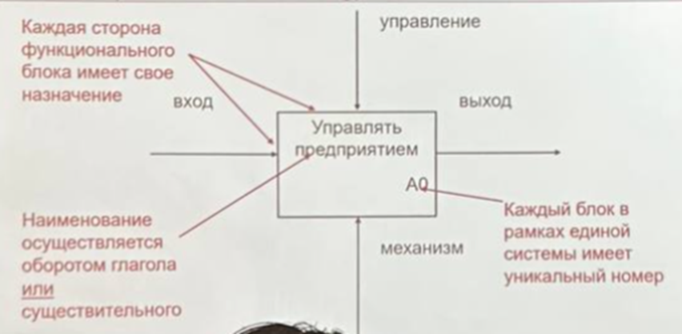
---

### 2.4 Интерфейсные дуги (стрелки)

Интерфейсные дуги отображают элементы системы,
которые обрабатываются функцией
или оказывают влияние на её выполнение.

Каждая дуга изображается в виде однонаправленной стрелки
и должна иметь уникальное имя,
сформулированное существительным.

В зависимости от положения дуги различают:

| Тип дуги | Назначение |
|--------|-----------|
| Вход | Объект преобразования |
| Выход | Результат выполнения функции |
| Управление | Правила и ограничения |
| Механизм | Исполнители и ресурсы |

Стрелка входа может отсутствовать,
остальные типы дуг являются обязательными.
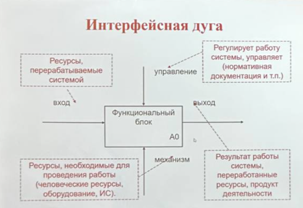
---

### 2.5 Декомпозиция в IDEF0

Декомпозиция применяется для разбиения
сложных процессов на составляющие функции.

Модель IDEF0 всегда начинается
с **контекстной диаграммы (A-0)**,
на которой система представляется
одним функциональным блоком.
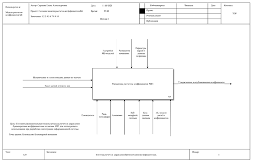

На последующих уровнях выполняется
детализация функций до требуемой глубины.
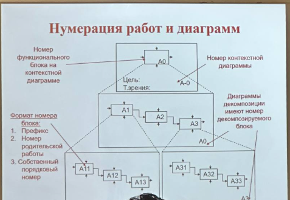
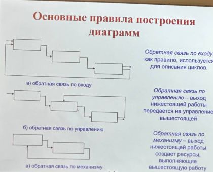

Пример

---

### 2.6 Цель и точка зрения моделирования

Цель моделирования определяет,
какие вопросы должна раскрывать модель.

Точка зрения — позиция,
с которой рассматривается система.
Как правило, выбирается точка зрения лица,
ответственного за выполнение моделируемой работы.

Между целью и точкой зрения
должно существовать жёсткое соответствие.

---

### 2.7 Основные правила построения диаграмм IDEF0

- на одной диаграмме рекомендуется размещать от 3 до 6 блоков;
- блоки располагаются слева направо и сверху вниз
  в порядке доминирования;
- следует избегать пересечения стрелок;
- допускается наличие обратных связей;
- стрелки могут сливаться и разветвляться.

---

## 3. Методология информационного моделирования IDEF1X

### 3.1 Назначение IDEF1X

IDEF1X — методология информационного моделирования,
основанная на концепции «сущность–связь».

Методология предназначена для описания структуры данных,
используемых в системе,
и связей между ними.

---

### 3.2 Основные понятия IDEF1X

IDEF1X использует следующие базовые понятия:

- сущность;
- атрибут;
- отношение.

**Сущность** — множество объектов,
обладающих общими атрибутами.

**Атрибут** — характеристика сущности.

**Отношение** — связь между сущностями,
именуемая глагольной формой.
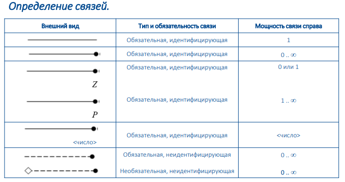
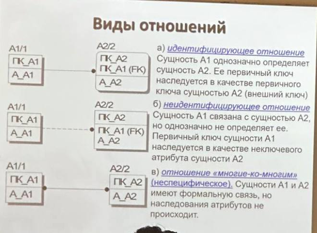

---

### 3.3 Уровни представления сущностей

Различают следующие уровни представления:

1. Диаграмма «сущность–связь» (ERD);
2. Модель данных, основанная на ключах;
3. Полная атрибутивная модель.

---

### 3.4 Основные правила построения информационной модели

- все стрелки функциональной модели IDEF0
  рассматриваются как потенциальные сущности;

- функции преобразуются в отношения между сущностями;

- формируется пул потенциальных сущностей;

- определяется мощность и типы отношений;

- атрибуты уточняются на основе анализа предметной области.
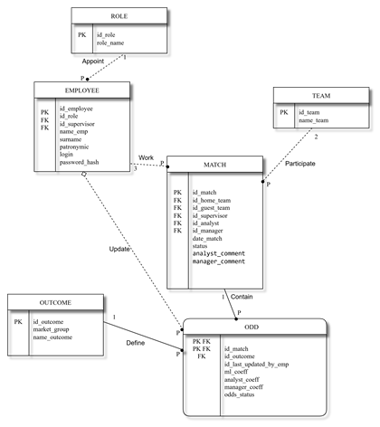
---

## 4. Методология моделирования процессов IDEF3

### 4.1 Назначение IDEF3

IDEF3 предназначена для моделирования процессов
как упорядоченной последовательности действий.

Методология позволяет отразить:
- последовательность процессов;
- логику взаимодействия элементов системы;
- альтернативные сценарии выполнения работ.

---

### 4.2 Основные элементы IDEF3

IDEF3-модель включает следующие элементы:

| Элемент | Назначение | Пример |
|------|-----------|-----------|
| Единица работ (UOW) | Отдельная работа | 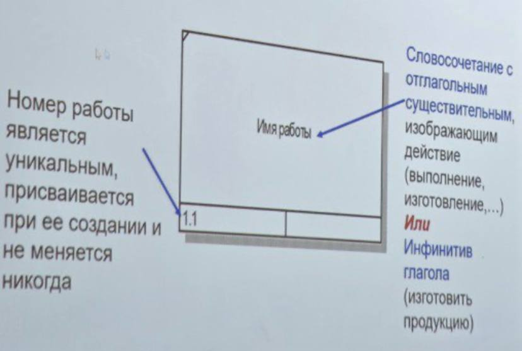 |
| Связи | Отношения между работами | -|
| Перекрёстки | Логика ветвления и слияния | - |
| Объекты ссылок | Поясняющие элементы | 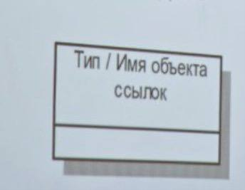  |

---

### 4.3 Связи в IDEF3

Различают три типа связей:

- старшая стрелка (временное предшествование) -  Соединяет единицы работ Показывает, что работа-источник должна быть закончена прежде, чем начнется работа-цель - Обычная;
- стрелка отношений (нечеткое отношение) - для изображения связи между единицами работ, а также между единицами работ и объектами ссылок - Пунктирная;
- поток объектов (поток объектов) - объект используется в двух и более единицах работ, например, когда объект порождается в одной работе и используется в другой. - Обычная стрелка с двойным треугольником;

Связи являются однонаправленными
и, как правило, направлены слева направо.

---

### 4.4 Перекрёстки в IDEF3

Перекрёстки используются для отображения
логики слияния и разветвления стрелок.

Все перекрёстки нумеруются
и имеют префикс **J**.

Различают:
- перекрёстки типа «И»;
- перекрёстки типа «ИЛИ»;
- перекрёстки типа «исключающее ИЛИ».

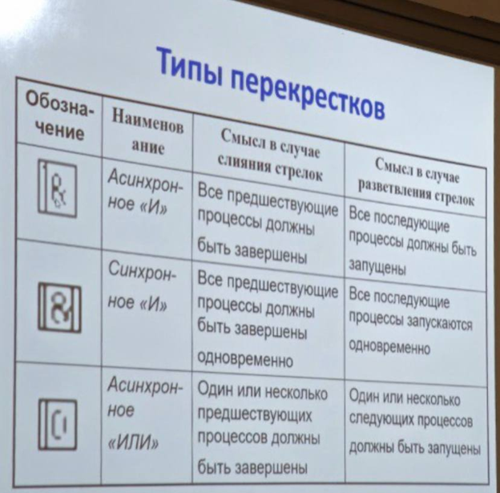
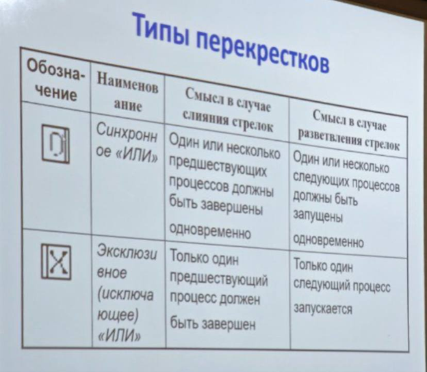
---

### 4.5 Декомпозиция работ в IDEF3

IDEF3 допускает многократную декомпозицию работ.
Одна работа может иметь несколько дочерних работ,
что позволяет описывать альтернативные потоки процесса.

Нумерация работ включает:
- номер родительской работы;
- номер версии декомпозиции;
- номер работы на диаграмме.
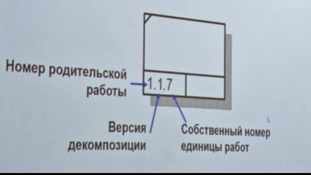

Пример декомпозиция первого блока idef0
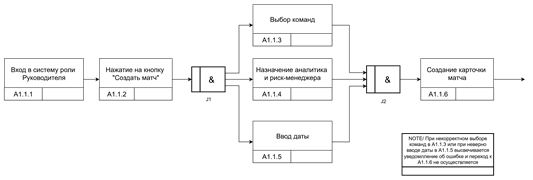
---

## 5. DFD — диаграммы потоков данных

### 5.1 Назначение DFD

DFD (Data Flow Diagrams) — диаграммы потоков данных,
предназначенные для моделирования процессов
преобразования и передачи информации в системе.

DFD-модель определяет систему
как иерархию диаграмм потоков данных,
отражающих преобразование информации
от входа системы до выдачи результата пользователю.

Основная цель DFD —
показать, как каждый процесс
преобразует входные данные в выходные,
а также выявить связи между процессами.

DFD-модели могут использоваться
в дополнение к функциональной модели IDEF0,
в частности для описания операций документооборота.

---

### 5.2 Уровни DFD-модели

DFD-модель строится в виде иерархии
и включает следующие уровни:

1. Уровень системы  
2. Уровень подсистемы  
3. Уровень процесса  

Переход между уровнями осуществляется
путём последовательной декомпозиции процессов.

---

### 5.3 Основные компоненты DFD

DFD-диаграммы включают следующие элементы:

- внешние сущности;
- процессы;
- системы и подсистемы;
- накопители данных;
- потоки данных.

---

### 5.4 Внешняя сущность

Внешняя сущность представляет собой
материальный объект или физическое лицо,
являющееся источником или приёмником информации.

Внешняя сущность:
- находится за пределами границ системы;
- может использоваться на одной или нескольких диаграммах;
- не является частью моделируемой системы.

Примеры внешних сущностей:
заказчик, клиент, поставщик, персонал, банк.

---

### 5.5 Система и подсистема

Система или подсистема отображается
на контекстной диаграмме
в виде одного процесса или группы процессов.

Наименование системы или подсистемы
представляется в виде словосочетания
с отглагольным существительным.

Примеры:
- обработка заявок;
- получение данных;
- формирование отчёта.

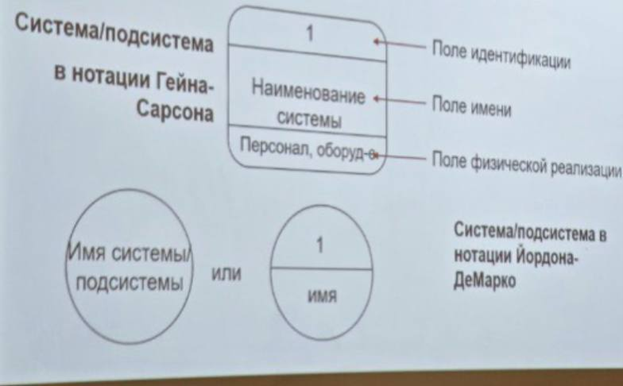
---

### 5.6 Процесс

Процесс представляет собой
преобразование входных потоков данных
в выходные в соответствии с определённым алгоритмом.

Процесс именуется
в виде словосочетания с активным глаголом
в неопределённой форме
и существительным в винительном падеже.

Примеры:
- обработать заявку;
- сформировать отчёт;
- проверить данные.
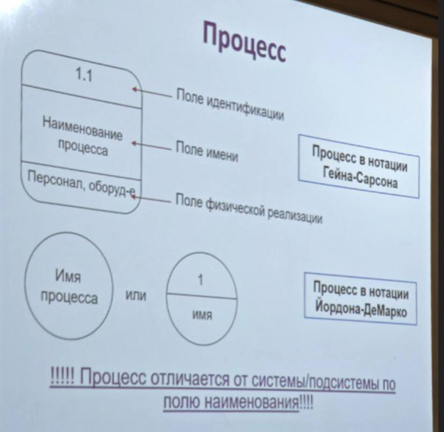
---

### 5.7 Накопитель данных

Накопитель данных —
абстрактное средство хранения информации,
в которое данные могут быть помещены
и извлечены через некоторое время.

Примеры накопителей данных:
- картотека;
- файл;
- таблица базы данных;
- электронный носитель.
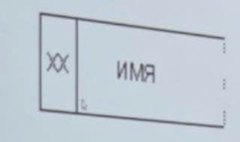
---

### 5.8 Поток данных

Поток данных определяет информацию,
передаваемую от источника к приёмнику
через соединения между элементами диаграммы.

Поток данных может представлять собой:
- документы;
- сообщения;
- электронные данные;
- сигналы.
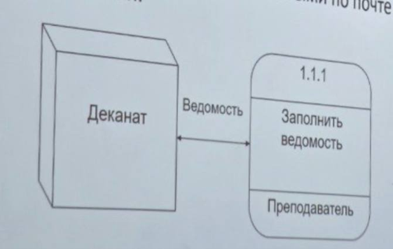
---

### 5.9 Иерархия DFD-диаграмм

DFD-модель строится последовательно:

1. Контекстная диаграмма уровня системы  
2. Диаграмма уровня подсистемы  
3. Диаграмма уровня процесса  

Каждый последующий уровень
детализирует процессы предыдущего уровня.

Пример контекстного уровня.
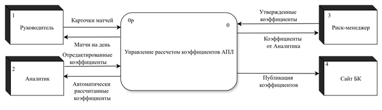

Пример Уровня подсистемы.
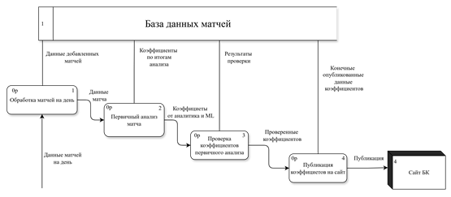

Пример декомпозиции блока
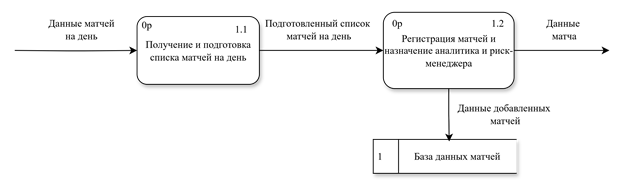

---

### 5.10 Связь DFD с методологиями IDEF

DFD используется совместно с методологиями IDEF
и дополняет функциональную модель IDEF0.

| Методология | Роль |
|-----------|------|
| IDEF0 | Определяет функции системы |
| DFD | Показывает потоки данных между функциями |
| IDEF1X | Формализует структуру данных |
| IDEF3 | Описывает последовательность выполнения процессов |

DFD позволяет уточнить,
какие данные используются в функциях IDEF0
и каким образом они передаются между процессами.

# ДЛЯ ОТВЕТА НА БИЛЕТ
## 9. Концепция IDEF

Концепция IDEF (Integrated DEFinition) представляет собой системный подход
к анализу и моделированию сложных организационно-технических и информационных систем.
IDEF разрабатывалась как набор взаимосвязанных методологий,
каждая из которых предназначена для описания системы
с определённой точки зрения.

Основная идея концепции IDEF заключается в том,
что сложную систему невозможно адекватно описать
с помощью одной универсальной модели.
Функциональные, информационные и процессные аспекты системы
обладают различной природой
и требуют применения специализированных методов моделирования.

В рамках концепции IDEF система рассматривается как целостный объект,
состоящий из функций, данных и процессов,
находящихся во взаимной зависимости.
Каждая методология IDEF фокусируется на одном аспекте,
но при этом логически связана с другими,
что позволяет получить непротиворечивое и комплексное представление системы.

Наиболее широко применяемыми методологиями являются:
- IDEF0 — для описания функций и их взаимосвязей;
- IDEF1X — для моделирования структуры и семантики данных;
- IDEF3 — для описания поведения системы во времени
  и сценариев выполнения процессов.

Таким образом, концепция IDEF обеспечивает многоаспектный анализ,
при котором:
- функции определяют, **что** делает система;
- данные определяют, **с чем** работает система;
- процессы определяют, **как и в какой последовательности**
  осуществляется деятельность.

Использование концепции IDEF особенно эффективно
на этапах предпроектного обследования,
анализа бизнес-процессов
и проектирования информационных систем,
так как позволяет формализовать знания о системе
и обеспечить единое понимание объекта моделирования
всеми участниками проекта.

---

## 10. Концепция IDEF3

Концепция IDEF3 ориентирована на процессный подход
и предназначена для моделирования поведения системы
в динамике, то есть во времени.
В отличие от функциональных моделей,
IDEF3 акцентирует внимание не на структуре функций,
а на последовательности их выполнения
и логике взаимодействия действий.

IDEF3 рассматривает процесс
как упорядоченную последовательность работ,
которые выполняются при определённых условиях
и могут иметь альтернативные сценарии.
Такой подход позволяет описывать
реальные бизнес-процессы в том виде,
в котором они фактически протекают в организации.

Ключевой особенностью концепции IDEF3
является возможность явного отображения:
- порядка выполнения операций;
- параллельных и альтернативных ветвей процесса;
- точек принятия решений;
- условий начала и завершения работ.

Процессная модель IDEF3 строится
на основе единиц работ,
которые соединяются между собой связями
и логическими перекрёстками.
Это позволяет детализировать процессы
до уровня конкретных сценариев
и выявлять узкие места,
избыточные операции
или потенциальные риски.

Концепция IDEF3 тесно связана с IDEF0.
Если IDEF0 отвечает на вопрос,
какие функции выполняет система,
то IDEF3 уточняет,
как именно эти функции реализуются во времени.
Таким образом, IDEF3 можно рассматривать
как развитие и детализацию функциональной модели,
ориентированную на практическое выполнение работ.

IDEF3 особенно востребована
при анализе регламентов,
описании бизнес-сценариев,
разработке инструкций
и моделировании процессов,
требующих чёткого понимания последовательности действий.

В совокупности с другими методологиями IDEF
IDEF3 позволяет перейти
от абстрактного описания системы
к детальному анализу её функционирования,
что повышает качество проектных решений
и снижает риски при внедрении информационных систем.

